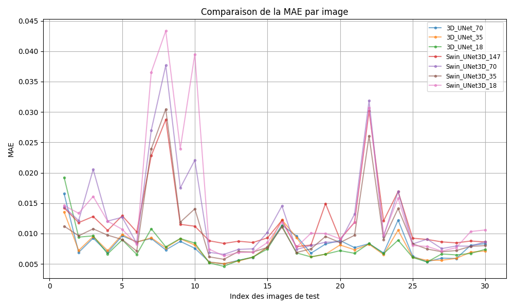
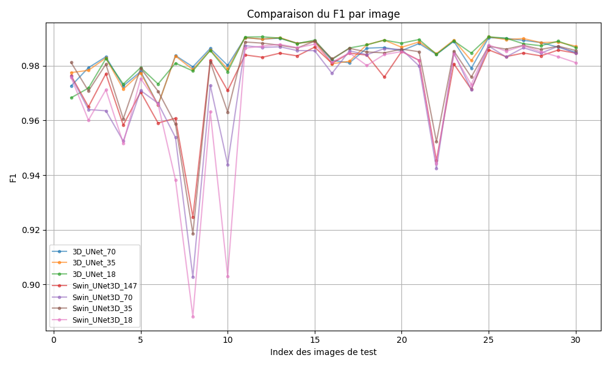
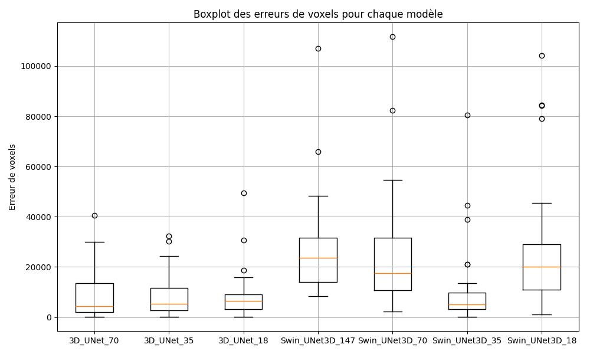

# Segmentation 3D des Lobes Pulmonaires

Ce projet contient le code et le développement de deux modèles de segmentation 3D pour les lobes pulmonaires à partir de scans CT. Deux architectures ont été implémentées et comparées :

- **3D U-Net**
- **Swin UNet 3D**

Ces modèles ont été entraînés sur des données médicales contenant les masques segmentés des lobes pulmonaires.

## Objectif du projet

L’objectif principal est de comparer les performances de deux architectures de deep learning pour la segmentation automatique des lobes pulmonaires, une tâche fondamentale pour de nombreuses analyses médicales ultérieures telles que la détection de nodules, de lésions ou de tumeurs.

## Données utilisées

Les modèles ont été entraînés séparément sur 4 sous-ensembles du dataset  
[disponible ici](https://cloud.imi.uni-luebeck.de/s/s64fqbPpXNexBPP) :

- 147 patients  
- 70 patients  
- 35 patients  
- 18 patients

Le choix de la segmentation des lobes pulmonaires s’explique par la relative facilité d’accès à ce type de données segmentées en 3D par rapport à d'autres structures pulmonaires.

## Résultats

Des graphiques comparatifs entre les deux modèles sont présentés ci-dessous, selon plusieurs métriques d’évaluation :

- **MAE (Mean Absolute Error)**
- **F1-score**
- **Distribution des scores (boxplot)**

### Comparaison des performances

## Auteur du projet

Projet réalisé dans le cadre d’un stage au **CETIC** par [Kadir Tas](https://www.linkedin.com/in/kadir-t-048473182/)

